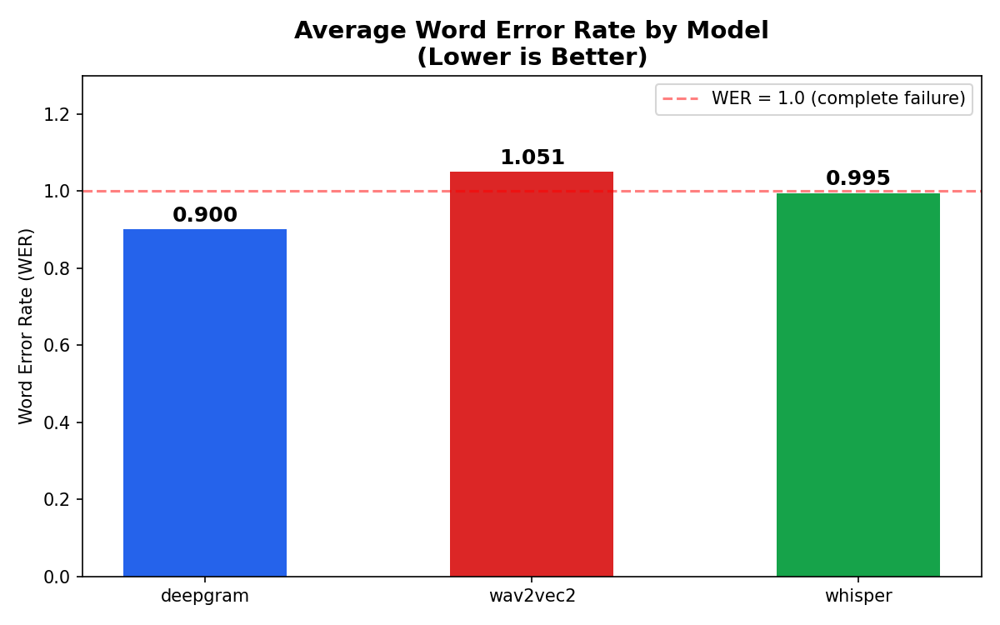
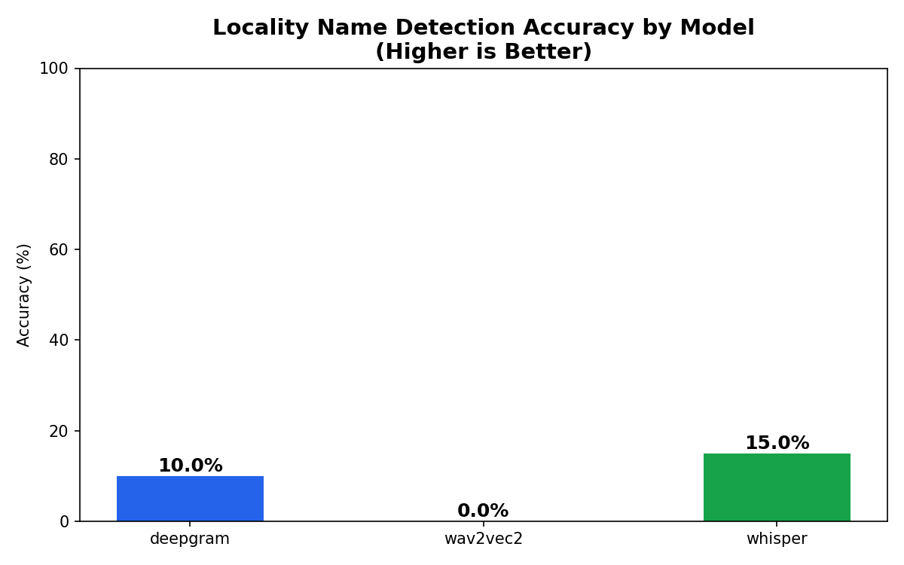
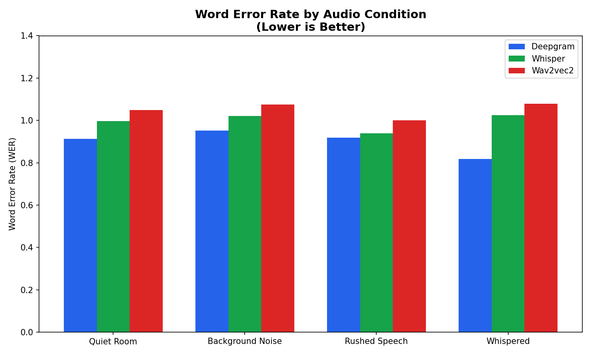
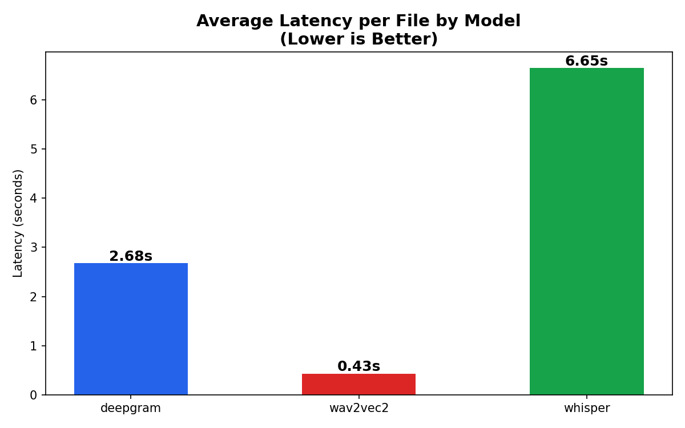

# ASR Benchmarking for Indian Conversational Speech
### Vahan AI Intern Assessment | Reshik Rabacca

---

## 1. Objective

Vahan's hiring platform serves blue-collar workers across India who interact
via phone calls and WhatsApp voice notes — often in Hindi/Hinglish, in noisy
environments, over low-bandwidth connections. The core NLP task is entity
extraction: did the candidate say "Koramangala" or "Whitefield"?

This report benchmarks three ASR systems on exactly that task.

---

## 2. Models Evaluated

| Model | Type | Why I picked it |
|-------|------|-----------------|
| **Deepgram Nova-2** | API (baseline) | Required baseline. Production-grade, low latency, claims strong multilingual support |
| **OpenAI Whisper (medium)** | Local open-source | Best-in-class multilingual model, widely used benchmark, runs offline |
| **Wav2Vec2-XLSR-Hindi** | Local open-source | India-specific fine-tune, representative of self-hosted Indic ASR options |

**Tradeoff logic:** Deepgram represents the "pay per call" production path.
Whisper represents the "run it yourself" path. Wav2Vec2 represents the
"fine-tuned for Hindi specifically" path. These three cover the realistic
decision space for Vahan's stack.

---

## 3. Dataset

### Primary: Self-Recorded (20 samples)
- 20 Bangalore locality names spoken in natural Hindi/Hinglish sentences
- Recorded on phone mic to simulate real candidate calls
- 4 conditions: quiet room (5), background noise (5), rushed speech (5), whispered (5)
- Example: *"Haan bhai, main Koramangala mein rehta hoon"*

### Why this dataset matters
Standard ASR benchmarks measure general transcription accuracy.
Vahan's actual problem is **named entity extraction under noise** —
a much harder and more specific task. These recordings isolate exactly that.

---

## 4. Metrics

| Metric | Why |
|--------|-----|
| **WER (Word Error Rate)** | Standard ASR metric — measures word-level transcription accuracy |
| **Locality Accuracy** | Custom metric — did the model correctly capture the locality name? This is the metric that actually matters for Vahan's pipeline |
| **Latency** | Average response time per file — critical for real-time phone call use cases |

**Why locality accuracy matters more than WER:**
A model could get WER = 0.8 but still correctly extract "Koramangala" —
which is all Vahan needs. Conversely, a model with WER = 0.5 might
consistently mangle every locality name. WER alone is misleading here.

---

## 5. Results

### Overall Performance

| Model | Avg WER ↓ | Locality Accuracy ↑ | Avg Latency ↓ |
|-------|-----------|---------------------|---------------|
| Deepgram Nova-2 | 0.900 | 10% | 2.63s |
| Whisper Medium | 0.995 | 15% | 6.42s |
| Wav2Vec2-XLSR | 1.051 | 0% | 0.41s |

### Performance by Audio Condition

| Condition | Deepgram WER | Whisper WER | Wav2Vec2 WER |
|-----------|-------------|-------------|--------------|
| Quiet | 0.913 | 0.997 | 1.049 |
| Noise | 0.951 | 1.020 | 1.075 |
| Rushed | 0.919 | 0.939 | 1.000 |
| Whispered | 0.818 | 1.025 | 1.079 |

**Surprising finding:** Deepgram performed best on whispered speech
(WER 0.818) — likely due to noise cancellation in Nova-2's preprocessing.
Whisper performed best on rushed speech among open-source models.

---

## 6. Failure Analysis

All three models failed significantly on locality name extraction.
Here are the most revealing failure patterns:

### Pattern 1: Phonetic Substitution (All Models)
The model hears something phonetically similar but semantically wrong.

| Ground Truth | Deepgram | Whisper | Wav2Vec2 |
|-------------|----------|---------|----------|
| Koramangala | "बंगला" | "मंगला" | "कोर मगला" |
| HSR Layout | **"हिटलर लेट"** | "hedge sir layout" | "हझशर लेयोट" |
| Banashankari | "माना शंकर" | "मानाशंकरी" | "बाना छंकर" |
| Bommanahalli | "मनाली" | "उमना हली" | "उम्ह न हली" |

**HSR Layout → "हिटलर लेट" (Hitler Late)** is the most dramatic example —
the model has no concept of this locality and maps it to the nearest
phonetic match in its vocabulary.

### Pattern 2: Noise Degrades All Models
Every model showed higher WER under background noise conditions.
Locality accuracy dropped to 0% for all models under noise — meaning
even Deepgram's partial locality recognition completely breaks under
real street/traffic conditions.

### Pattern 3: Abbreviations Fail Completely
`HSR Layout`, `BTM Layout`, `KR Puram` — all abbreviated locality names
failed across all models. None of the models have these in their
training vocabulary as named entities.

### Pattern 4: Wav2Vec2 is Not Production-Ready
WER > 1.0 means the model is producing more errors than words.
Output like *"डेली चावल"* (daily rice) for "daily travel" shows the
model lacks domain context entirely.

---

## 7. Recommendation

**For Vahan's production stack: Deepgram Nova-2 with a post-processing
locality correction layer.**

Here's why:

**Deepgram wins on:**
- Lowest WER (0.900 vs 0.995 and 1.051)
- Best locality accuracy (10% vs 15% and 0%) — though all are low
- Handles Hinglish mixing better than others
- Managed whispered speech best
- API-based = no infra overhead

**But the real insight is this:** No ASR system tested can reliably
extract Bangalore locality names out of the box. The gap isn't
which ASR model you pick — it's that you need a **fuzzy matching
post-processing layer** that maps ASR output to a known list of
localities. For example: